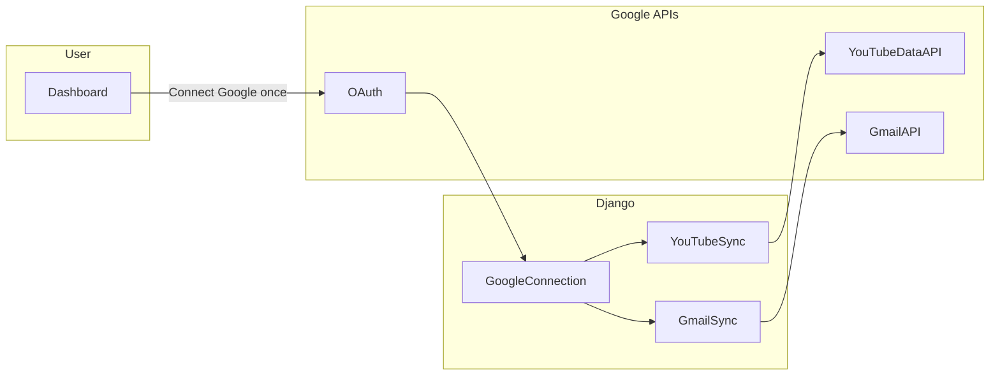

# Google Integrations — YouTube Catalog + Gmail Inbox

## Current state

- YouTube and Email are **UI-only** (“coming soon” in [`frontend/components/layout/sidebar.tsx`](frontend/components/layout/sidebar.tsx)).
- App login is **JWT email/password** ([`backend/accounts/`](backend/accounts/)); no Google OAuth yet.
- Roadmap already listed both integrations ([`README.md`](README.md)).

## Your choices (confirmed)

| Area | Decision |
|------|------------|
| YouTube | Own channel via Google OAuth; **catalog MVP** (uploads vs Shorts, thumbnails, dates, view counts) |
| Gmail | **Same Google OAuth**; **read-only inbox viewer** (recent mail, open message body) |
| Analytics | YouTube Analytics API, send/reply mail, multiple channels — **later** |

## Why combine OAuth?

Yes — **one Google OAuth connection** can serve both products:

- Same **OAuth client** (client ID/secret)
- Same **callback URL**
- One consent screen requesting **multiple scopes**
- One **refresh token** stored per user
- Separate sync jobs per API (YouTube Data API vs Gmail API)

This avoids connecting Google twice and matches how solo dashboards (Notion, Zapier-style) handle “Connect Google account.”



## Google Cloud setup (one-time, manual)

1. Create/select a Google Cloud project.
2. Enable APIs:
   - **YouTube Data API v3**
   - **Gmail API**
3. Configure **OAuth consent screen** (External; add your Google account as test user for dev).
4. Create **OAuth 2.0 Web client**:
   - Redirect URI: `http://localhost:8000/api/integrations/google/callback/`
5. Env vars in [`backend/.env`](backend/.env):

```env
GOOGLE_OAUTH_CLIENT_ID=...
GOOGLE_OAUTH_CLIENT_SECRET=...
GOOGLE_OAUTH_REDIRECT_URI=http://localhost:8000/api/integrations/google/callback/
FRONTEND_URL=http://localhost:3000
```

### OAuth scopes (v1)

| Scope | Used for |
|-------|----------|
| `https://www.googleapis.com/auth/youtube.readonly` | Channel + uploads playlist + video stats |
| `https://www.googleapis.com/auth/gmail.readonly` | List inbox + read message bodies |

Both requested in **one** authorize URL so the user consents once.

## Backend design

### New Django app: `integrations`

Central place for Google OAuth and shared connection state.

#### Model: `GoogleConnection` (one per user)

| Field | Purpose |
|-------|---------|
| `user` | OneToOne → `User` |
| `google_email` | Primary Google account email |
| `access_token`, `refresh_token`, `token_expiry` | OAuth tokens |
| `scopes` | Granted scope list (JSON/text) |
| `channel_id`, `channel_title`, `channel_thumbnail` | YouTube channel metadata (filled on first YouTube sync) |
| `youtube_last_synced_at`, `gmail_last_synced_at` | Per-product sync timestamps |

#### Model: `YouTubeVideo`

Cached catalog (FK → `GoogleConnection`):

- `video_id`, `title`, `thumbnail_url`, `published_at`, `duration_seconds`, `view_count`
- `video_type`: `upload` \| `short` (Short if duration ≤ 60s from `contentDetails.duration`)

#### Model: `GmailMessage`

Cached inbox rows (FK → `GoogleConnection`):

- `message_id`, `thread_id`, `subject`, `from_address`, `from_name`, `snippet`
- `received_at`, `is_read`
- `body_text` / `body_html` (populated when user opens message or during sync for recent N)

### Shared OAuth ([`backend/integrations/google_oauth.py`](backend/integrations/google_oauth.py))

- `build_authorize_url(user)` — includes `state` (signed user id + nonce) for CSRF protection
- `handle_callback(code, state)` — exchange code, upsert `GoogleConnection`
- `get_credentials(connection)` — refresh access token if expired; used by all sync code
- `disconnect(connection)` — delete local row + optional Google revoke

### YouTube sync ([`backend/integrations/youtube_sync.py`](backend/integrations/youtube_sync.py))

1. `channels.list(mine=true)` → uploads playlist ID + channel snippet/stats
2. Paginate `playlistItems.list`
3. Batch `videos.list(part=snippet,contentDetails,statistics)`
4. Upsert `YouTubeVideo`; classify Shorts (≤ 60s)

### Gmail sync ([`backend/integrations/gmail_sync.py`](backend/integrations/gmail_sync.py))

1. `users.messages.list(userId=me, labelIds=INBOX, maxResults=50)` — recent inbox
2. Upsert `GmailMessage` metadata (subject, from, snippet, date, unread)
3. On detail fetch: `users.messages.get(format=full)` → parse plain/HTML body into cache

Use `google-api-python-client` + `google-auth` (add to [`backend/requirements.txt`](backend/requirements.txt)).

### API endpoints

**Shared Google**

| Method | Path | Description |
|--------|------|-------------|
| GET | `/api/integrations/google/connect/` | OAuth URL (JWT required) |
| GET | `/api/integrations/google/callback/` | Public; saves tokens; redirects to `/dashboard/integrations?connected=1` |
| GET | `/api/integrations/google/status/` | `{ connected, google_email, youtube_ready, gmail_ready, last_synced... }` |
| DELETE | `/api/integrations/google/disconnect/` | Remove connection + cached data |

**YouTube**

| Method | Path | Description |
|--------|------|-------------|
| POST | `/api/integrations/youtube/sync/` | Sync video catalog |
| GET | `/api/integrations/youtube/videos/` | `?type=short\|upload\|all` |

**Gmail**

| Method | Path | Description |
|--------|------|-------------|
| POST | `/api/integrations/gmail/sync/` | Refresh inbox cache |
| GET | `/api/integrations/gmail/messages/` | List cached messages |
| GET | `/api/integrations/gmail/messages/{id}/` | Full message (sync body if missing) |

Register under [`backend/config/urls.py`](backend/config/urls.py) as `api/integrations/`.

**Security**

- All endpoints scoped to `request.user`; tokens never sent to frontend.
- OAuth `state` validated on callback.
- Gmail/YouTube data deleted on disconnect.

## Frontend design

### `/dashboard/integrations` (new)

- **Not connected:** single CTA — “Connect Google account” (YouTube + Gmail).
- **Connected:** show `google_email`, last sync times, **Disconnect**, links to YouTube and Email pages.
- Return landing after OAuth (`?connected=1`).

### `/dashboard/youtube`

- Requires Google connection; prompt to connect if missing.
- Channel header, **Sync now**, tabs: All | Videos | Shorts.
- Video grid: thumbnail, title, views, date, type badge.

### `/dashboard/email`

- Requires Google connection.
- Inbox list: subject, sender, date, unread indicator.
- Click row → slide-over or detail panel with message body (read-only).
- **Refresh** button triggers gmail sync.

### Sidebar

Move **YouTube** and **Email** out of `comingSoon` in [`frontend/components/layout/sidebar.tsx`](frontend/components/layout/sidebar.tsx); add **Integrations** (optional) or rely on connect CTAs on each page.

### API client + types

Extend [`frontend/lib/api.ts`](frontend/lib/api.ts) and [`frontend/lib/types.ts`](frontend/lib/types.ts) for Google status, YouTube videos, Gmail messages.

## Out of scope for v1

- YouTube Analytics API (watch time, revenue, traffic).
- Gmail send/reply/compose, labels UI beyond basic inbox, push notifications (Pub/Sub).
- Multiple Google accounts or channels per user.
- Linking videos/emails to Projects/Kanban.
- Background cron sync (manual Sync/Refresh + sync on first connect).
- Token encryption at rest (follow-up hardening).

## Testing checklist

- Single Google connect grants both YouTube + Gmail access.
- YouTube sync lists uploads and Shorts correctly.
- Gmail inbox lists recent messages; opening one shows body.
- Disconnect clears tokens and cached YouTube/Gmail data.
- Token refresh works after access token expiry.
- User without connection sees connect prompt on YouTube/Email pages.

## Implementation order

1. Google Cloud: enable both APIs, OAuth client, env vars
2. `integrations` app: `GoogleConnection`, OAuth flow, status/disconnect
3. YouTube sync + endpoints + `/dashboard/youtube`
4. Gmail sync + endpoints + `/dashboard/email`
5. `/dashboard/integrations` hub + sidebar updates
6. End-to-end test with your Google account
